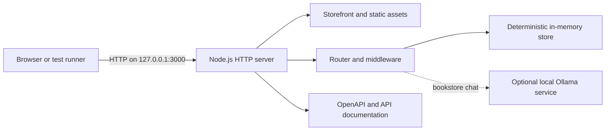

<p align="center">
  
</p>

<h1 align="center">Tech Book Store</h1>

<p align="center">
  <strong>Practice Storefront Demo Application for End-to-End Test Automation</strong>
</p>

<p align="center">
  
  
  
  
</p>

Tech Book Store is a self-contained storefront and REST API designed for UI,
API, and end-to-end test automation practice. It provides deterministic seed
data, stable automation selectors, realistic authentication and commerce
flows, a dedicated automation playground, and failure scenarios that can be
reset between test runs.

> [!IMPORTANT]
> This application is intentionally designed for an isolated local practice
> environment. It exposes seeded credentials, an unauthenticated reset
> endpoint, and permissive CORS. Do not deploy it to a public or production
> environment without a separate security review and appropriate hardening.
> It is intended exclusively for learning, demonstration, and test-automation
> practice and is not intended or supported for production or commercial
> deployment.

## Table of contents

- [Overview](#overview)
- [Key capabilities](#key-capabilities)
- [Architecture](#architecture)
- [Prerequisites](#prerequisites)
- [Quick start](#quick-start)
- [Application endpoints](#application-endpoints)
- [Seed data and practice accounts](#seed-data-and-practice-accounts)
- [Storefront functionality](#storefront-functionality)
- [API capabilities](#api-capabilities)
- [Configuration](#configuration)
- [Optional local AI assistant](#optional-local-ai-assistant)
- [Security and data model](#security-and-data-model)
- [Test automation guidance](#test-automation-guidance)
- [Project structure](#project-structure)
- [Development workflows](#development-workflows)
- [Troubleshooting](#troubleshooting)
- [Documentation](#documentation)
- [Maintenance expectations](#maintenance-expectations)
- [Ownership and support](#ownership-and-support)
- [License](#license)

## Overview

This repository owns the **system under test**. It deliberately keeps the
application separate from Playwright suites and other test-only dependencies.
An external automation project can therefore exercise the same application
through its public browser and HTTP contracts without coupling tests to the
implementation.

The complete application runs in one Node.js process:

- The storefront is a responsive, single-file browser application.
- The API is implemented with Node.js built-ins and has no runtime package
  dependencies.
- Storefront files, brand assets, book covers, API documentation, and API
  routes are served from the same local origin.
- Application data is held in memory and restored to a known seed by a single
  reset endpoint.
- The optional bookstore assistant connects only to a locally running Ollama
  instance and does not require a paid API key.

## Key capabilities

| Area | Capability |
| --- | --- |
| Storefront | Catalogue browsing, search, filtering, sorting, book details, authors, reviews, wishlist, cart, checkout, orders, account management, and admin catalogue management |
| UI automation | Stable `data-testid` attributes, predictable hash routes, loading and empty states, role-based screens, validation, and an automation playground |
| API automation | 41 documented API paths covering health, authentication, CRUD, pagination, filtering, sparse fieldsets, ETags, idempotency, rate limiting, delays, custom status codes, and echo requests |
| Authentication | Registration, login, short-lived JWT access tokens, one-time refresh-token rotation, logout revocation, API key authentication, and HTTP Basic authentication |
| Authorization | Anonymous, authenticated user, resource owner, and administrator behavior |
| Repeatability | Deterministic seed data and `POST /api/reset` for clearing mutations, tokens, rate-limit counters, chat sessions, and idempotency keys |
| API contracts | OpenAPI 3.0.3 specification, interactive API documentation, Postman collection, and Postman environment |
| Local AI | Optional Ollama-powered, catalogue-grounded assistant with bounded sessions, rate limits, and guarded state-changing tools |
| Runtime | Node.js 20 or newer, zero third-party runtime dependencies, no compilation step, and no database setup |

## Architecture



### Request flow

1. `api/server.js` creates the HTTP server and initializes the seed data.
2. `api/src/app.js` applies CORS and security headers, serves owned static
   assets, and delegates API requests to the router.
3. Route modules apply authentication, authorization, validation, query,
   rate-limit, and business rules.
4. The in-memory store returns or mutates the active practice data.
5. Errors are returned in a consistent JSON envelope with a request ID.

## Prerequisites

### Required

- [Node.js](https://nodejs.org/) **20 or newer**
- npm, included with Node.js
- A modern browser for the storefront and interactive API documentation

Verify the installed versions:

```bash
node --version
npm --version
```

### Optional

- [Ollama](https://ollama.com/) for the local bookstore assistant
- Postman for using the published collection and environment
- An external Playwright or other test-automation project

No database, build tool, package installation, cloud account, or API key is
required for the core application.

## Quick start

Run the following command **directly from the project root**:

```bash
npm start
```

There is no need to change into the `api` directory and no `npm install` step
is required. The root start script launches `api/server.js`.

When startup succeeds, open the storefront:

<http://127.0.0.1:3000/techbookstore-shop.html>

Stop the server gracefully with `Ctrl+C`.

### Run on a different port

macOS or Linux:

```bash
PORT=3001 npm start
```

Windows PowerShell:

```powershell
$env:PORT=3001; npm start
```

Update the URLs in this document from port `3000` to the selected port.

## Application endpoints

| Service | Local URL | Purpose |
| --- | --- | --- |
| Storefront | <http://127.0.0.1:3000/techbookstore-shop.html> | Browser-based practice application |
| API documentation | <http://127.0.0.1:3000/docs> | Interactive API reference |
| OpenAPI specification | <http://127.0.0.1:3000/openapi.json> | Machine-readable OpenAPI 3.0.3 contract |
| API index | <http://127.0.0.1:3000/api> | JSON discovery document |
| Health check | <http://127.0.0.1:3000/health> | Liveness, uptime, and timestamp |

> [!NOTE]
> The server root, <http://127.0.0.1:3000/>, redirects to the API
> documentation. Use the storefront URL above to open the shop.

## Seed data and practice accounts

Every server start creates a fresh in-memory data set.

| Resource | Seed count |
| --- | ---: |
| Books | 100 |
| Authors | 20 |
| Categories | 10 |
| Publishers | 8 |
| Users | 7 |
| Reviews | 50 |
| Orders | 0 |

### Visible practice accounts

| Role | Email | Password | Intended use |
| --- | --- | --- | --- |
| Administrator | `admin@bookstore.test` | `admin123` | Catalogue administration and privileged API flows |
| User | `user@bookstore.test` | `password123` | Shopping, reviews, wishlist, cart, checkout, and ownership rules |

These credentials are public by design and must never be reused outside this
local practice application.

### Reset all practice state

```bash
curl -X POST http://127.0.0.1:3000/api/reset
```

The reset restores seed data and clears issued or revoked tokens, login and
practice rate-limit counters, order idempotency keys, and chat session state.
Use it before an automation run when deterministic state is required.

## Storefront functionality

| Route | Experience | Access |
| --- | --- | --- |
| `#/` | Home, categories, and featured books | Public |
| `#/books` | Searchable, filterable, sortable, and paginated catalogue | Public |
| `#/books/:id` | Book details, rating, stock, reviews, wishlist, and cart actions | Mixed |
| `#/authors/:id` | Author information and authored books | Public |
| `#/login` and `#/register` | Authentication and account creation | Public |
| `#/wishlist` | Saved books | User or admin |
| `#/cart` | Cart items and quantity management | User or admin |
| `#/checkout` | Address, payment selection, and order placement | User or admin |
| `#/orders` and `#/orders/:id` | Order history, details, and eligible cancellation | User or admin |
| `#/account` | Current-account profile | User or admin |
| `#/admin` | Catalogue management | Admin only |
| `#/playground` | Dedicated browser-automation interaction scenarios | Public |

The storefront uses same-origin API calls and is not intended to be opened
directly from the filesystem with a `file://` URL.

## API capabilities

The API exposes 41 documented paths. Consult the interactive documentation or
OpenAPI file for complete schemas, parameters, response examples, and status
codes.

| Domain | Base paths | Highlights |
| --- | --- | --- |
| System | `/health`, `/api/health`, `/api`, `/api/reset` | Liveness, discovery, and deterministic reset |
| Authentication | `/api/auth/*` | Register, login, refresh, logout, current user, API key, and Basic auth |
| Books | `/api/books/*` | Rich querying, admin CRUD, optimistic concurrency, soft delete, and restore |
| Reference data | `/api/authors/*`, `/api/categories/*`, `/api/publishers/*` | List, detail, and admin CRUD operations |
| Reviews | `/api/reviews/*`, `/api/books/:id/reviews` | Review listing plus owner-or-admin mutation rules |
| Users | `/api/users/*` | Admin listing and self-or-admin access rules |
| Commerce | `/api/cart/*`, `/api/wishlist/*`, `/api/orders/*` | Per-user shopping state, checkout, idempotency, status transitions, and cancellation |
| Chatbot | `/api/chat`, `/api/chat/status`, `/api/chat/session/:sessionId` | Optional local catalogue assistant and bounded session cleanup |
| Practice | `/api/limited`, `/api/delay`, `/api/status/:code`, `/api/echo` | Purpose-built error, delay, header, method, and rate-limit scenarios |

### Collection query features

Collection endpoints support a shared query model where applicable:

```text
?page=2&limit=10
?sort=price&order=desc
?search=playwright
?fields=id,title,price
?inStock=true
?minPrice=20&maxPrice=40
```

- Pagination defaults to 10 records and is capped at 100 records per page.
- Search is a case-insensitive substring match across configured fields.
- Exact-match, minimum, and maximum filters are type-coerced where possible.
- Sparse fieldsets return only the requested fields.
- Pagination metadata includes totals and previous/next-page indicators.

### Authentication methods

| Method | Usage |
| --- | --- |
| Bearer JWT | Use the `accessToken` returned by `POST /api/auth/login` |
| Refresh token | Submit the one-time refresh token to `POST /api/auth/refresh`; successful use rotates it |
| API key | Send `X-API-Key` to `GET /api/auth/apikey` |
| HTTP Basic | Send Basic credentials to `GET /api/auth/basic` |

Example login:

```bash
curl -X POST http://127.0.0.1:3000/api/auth/login \
  -H "Content-Type: application/json" \
  -d '{"email":"user@bookstore.test","password":"password123"}'
```

Example authenticated request:

```bash
curl http://127.0.0.1:3000/api/auth/me \
  -H "Authorization: Bearer <access-token>"
```

### Advanced automation contracts

- `GET /api/books/:id` returns an `ETag`. `PUT` and `PATCH` accept `If-Match`
  and return `412 Precondition Failed` for a stale version.
- `POST /api/orders` accepts `Idempotency-Key`. Replaying the same key for the
  same user returns the existing order instead of creating another one.
- `GET /api/limited` returns rate-limit headers and eventually responds with
  `429 Too Many Requests` plus `Retry-After`.
- `/api/delay`, `/api/status/:code`, and `/api/echo` provide deterministic
  timeout, status-code, method, body, query, and header exercises.
- All handled API failures use the standard envelope
  `{ "error": { "code": "...", "message": "..." } }`.
- Responses include `X-Request-Id`; callers may supply their own request ID.

## Configuration

All configuration is optional. Defaults are suitable for a local practice
session.

### Server and data behavior

| Environment variable | Default | Description |
| --- | --- | --- |
| `HOST` | `127.0.0.1` | Network interface to bind |
| `PORT` | `3000` | HTTP port |
| `ALLOW_INSECURE_PUBLIC_DEMO` | `false` | Required as `true` before binding to a non-loopback host |
| `LOG_REQUESTS` | `true` | Set to `false` to disable request/response console logs |
| `DEFAULT_PAGE_SIZE` | `10` | Default collection page size |
| `MAX_PAGE_SIZE` | `100` | Maximum accepted collection page size |

### Authentication

| Environment variable | Default | Description |
| --- | --- | --- |
| `JWT_SECRET` | Random per process | JWT signing secret; a restart invalidates prior tokens when not explicitly set |
| `ACCESS_TOKEN_TTL` | `900` | Access-token lifetime in seconds |
| `REFRESH_TOKEN_TTL` | `604800` | Refresh-token lifetime in seconds |
| `API_KEY` | `tbs_live_9c8b7a6d5e4f3210` | Credential for the API-key practice endpoint |
| `BASIC_USER` | `basic_user` | Username for the Basic-auth practice endpoint |
| `BASIC_PASS` | `basic_pass_123` | Password for the Basic-auth practice endpoint |

### Rate limits

| Environment variable | Default | Description |
| --- | --- | --- |
| `RATE_LIMIT_MAX` | `5` | Allowed requests to `/api/limited` per client and window |
| `RATE_LIMIT_WINDOW_MS` | `10000` | Practice rate-limit window in milliseconds |
| `LOGIN_RATE_LIMIT_MAX` | `20` | Login attempts allowed per client and email per window |
| `LOGIN_IP_RATE_LIMIT_MAX` | `60` | Login attempts allowed per client IP per window |
| `LOGIN_RATE_LIMIT_WINDOW_MS` | `60000` | Login rate-limit window in milliseconds |

### Local chatbot

| Environment variable | Default | Description |
| --- | --- | --- |
| `CHATBOT_ENABLED` | `true` | Set to `false` to disable chatbot endpoints |
| `OLLAMA_URL` | `http://127.0.0.1:11434` | Local Ollama base URL |
| `CHATBOT_MODEL` | `gemma3:4b` | Ollama model name |
| `CHATBOT_TOOL_MODE` | `auto` | Tool protocol: `auto`, `native`, or `structured` |
| `CHATBOT_THINK` | `false` | Set to `true` to enable model thinking where supported |
| `CHATBOT_CONTEXT_TOKENS` | `16384` | Ollama context-window size |
| `CHATBOT_TIMEOUT_MS` | `120000` | Chat request timeout in milliseconds |
| `CHATBOT_MAX_TOOL_ROUNDS` | `6` | Maximum tool-execution rounds per message |
| `CHATBOT_RATE_LIMIT_MAX` | `20` | Chat messages allowed per client and window |
| `CHATBOT_RATE_LIMIT_WINDOW_MS` | `60000` | Chat rate-limit window in milliseconds |

Example configuration:

```bash
PORT=3001 LOG_REQUESTS=false CHATBOT_ENABLED=false npm start
```

## Optional local AI assistant

The application works normally when Ollama is unavailable. To enable the
assistant, install Ollama, make sure its local service is running, and install
the configured model:

```bash
ollama pull gemma3:4b
```

Then start the application with `npm start` and use the assistant launcher in
the storefront. Check availability through:

```bash
curl http://127.0.0.1:3000/api/chat/status
```

The assistant is grounded in the bookstore catalogue. Its server-side tool
layer requires an explicit customer request before state-changing cart or
order actions and verifies book identifiers before book mutations.

## Security and data model

### Deliberate local-practice characteristics

- The default bind address is loopback-only: `127.0.0.1`.
- A non-loopback `HOST` is rejected unless
  `ALLOW_INSECURE_PUBLIC_DEMO=true` is explicitly supplied.
- CORS allows all origins to support local browser and API tools.
- Seeded credentials and the reset endpoint are intentionally visible.
- Data, refresh tokens, revoked access-token IDs, rate-limit buckets, chat
  sessions, and idempotency keys exist only in process memory.
- Restarting the process resets all data. With the default random JWT secret,
  it also makes tokens from the prior process invalid.

### Response protections

The server applies content-type sniffing protection, clickjacking protection,
a no-referrer policy, a restrictive permissions policy, a same-origin content
security policy, controlled request-size handling, and generic unexpected-error
responses that avoid leaking implementation details.

These controls improve the practice environment but do not convert it into a
production-ready service. Production deployment would require persistent
storage, secret management, origin restrictions, transport security,
observability, backups, dependency and threat reviews, and an authenticated
administrative reset strategy.

## Test automation guidance

### Recommended suite setup

1. Start the application in a dedicated process.
2. Poll `GET /health` until it returns `200`.
3. Call `POST /api/reset` once before the suite or before each isolated test
   group.
4. Configure the browser base URL as
   `http://127.0.0.1:3000/techbookstore-shop.html`.
5. Configure the API base URL as `http://127.0.0.1:3000`.
6. Prefer `data-testid` selectors for application-owned controls.
7. Create unique users or resource names when running mutating tests in
   parallel.

### Isolation considerations

- The application has one shared in-memory state per server process.
- A reset performed by one worker affects all other workers using that server.
- Use one reset at suite startup, partition test data, or run separate server
  instances on different ports for fully isolated parallel workers.
- Access tokens expire after 15 minutes by default; automation should test or
  support refresh behavior rather than assuming indefinitely valid sessions.
- Avoid assertions against process uptime, generated token values, timestamps,
  or request IDs unless the scenario specifically targets those fields.

### Suggested coverage areas

- Anonymous, user, owner, non-owner, and administrator authorization
- Registration, login, logout, token expiration, and refresh-token rotation
- Search, filters, sorting, pagination, field selection, and empty states
- Cart totals, stock changes, checkout, idempotent order creation, and cancel
  behavior
- Review ownership and catalogue administration
- `400`, `401`, `403`, `404`, `409`, `412`, `422`, `429`, and `5xx` handling
- Network delays, retries, disabled controls, validation, and accessibility
- Responsive navigation and footer layout

## Project structure

```text
.
├── package.json                 # Project-root launch command
├── README.md                    # Primary project documentation
├── api/
│   ├── server.js                # HTTP server entry point
│   ├── package.json             # API maintenance scripts
│   ├── src/
│   │   ├── app.js               # Request pipeline and static assets
│   │   ├── config.js            # Environment-based configuration
│   │   ├── router.js            # Lightweight router
│   │   ├── seed.js              # Deterministic practice data
│   │   ├── store.js             # In-memory data lifecycle
│   │   ├── auth/                # JWT, passwords, and token lifecycle
│   │   ├── chat/                # Ollama integration and guarded tools
│   │   ├── lib/                 # HTTP, query, validation, and error helpers
│   │   ├── middleware/          # Authentication, authorization, CORS, limits
│   │   └── routes/              # Domain route modules
│   ├── docs/                    # Interactive docs and OpenAPI contract
│   ├── postman/                 # Postman collection and environment
│   ├── guide/                   # Published practice API guide
│   └── tools/                   # Documentation and catalogue generators
├── web/
│   ├── techbookstore-shop.html  # Storefront application
│   ├── techbookstore-books-catalog.json
│   ├── brand-assets/            # Header and favicon artwork
│   └── book-covers/             # Owned catalogue cover assets
└── docs/
    └── requirements/            # Master and detailed v7.2 specifications
```

## Development workflows

Run every command below from the project root.

| Task | Command | Generated artifact |
| --- | --- | --- |
| Start the complete application | `npm start` | Running local server |
| Validate the server entry point | `node --check api/server.js` | None |
| Validate the application pipeline | `node --check api/src/app.js` | None |
| Rebuild the OpenAPI contract | `npm --prefix api run build:openapi` | `api/docs/openapi.json` |
| Rebuild the Postman collection | `npm --prefix api run build:postman` | `api/postman/TechBookStore.postman_collection.json` |
| Re-export the storefront catalogue | `npm --prefix api run export:catalog` | `web/techbookstore-books-catalog.json` |

The OpenAPI file, Postman collection, and storefront catalogue are generated
artifacts. Update their generator scripts first, regenerate the outputs, and
review both source and output together.

## Troubleshooting

<details>
<summary><strong>Port 3000 is already in use</strong></summary>

Stop the process currently using port `3000`, or start this application on a
different port:

```bash
PORT=3001 npm start
```

</details>

<details>
<summary><strong>The storefront does not load when the HTML file is opened directly</strong></summary>

Do not open `web/techbookstore-shop.html` with a `file://` URL. Start the Node
server and use <http://127.0.0.1:3000/techbookstore-shop.html> so storefront
requests and assets share the API origin.

</details>

<details>
<summary><strong>A previously valid token now returns 401</strong></summary>

The default JWT secret is generated for each process. Restarting the server
invalidates tokens created by the previous process. Log in again, or set a
stable local `JWT_SECRET` when a scenario requires tokens to survive restarts.

</details>

<details>
<summary><strong>The bookstore assistant reports that Ollama is offline</strong></summary>

Confirm Ollama is running at `OLLAMA_URL` and that the configured model exists:

```bash
ollama list
ollama pull gemma3:4b
```

The rest of the storefront remains available. Set `CHATBOT_ENABLED=false` to
disable chatbot endpoints intentionally.

</details>

<details>
<summary><strong>The server refuses a public host binding</strong></summary>

This is a security guard, not a startup defect. The application exposes
practice credentials and a reset endpoint. Prefer the default loopback host.
Only set `ALLOW_INSECURE_PUBLIC_DEMO=true` for an intentionally exposed and
separately reviewed demonstration environment.

</details>

## Documentation

| Document | Location |
| --- | --- |
| Interactive API documentation | `http://127.0.0.1:3000/docs` while running |
| OpenAPI 3.0.3 contract | [`api/docs/openapi.json`](./api/docs/openapi.json) |
| Practice API guide | [`api/guide/TechBookStore-Practice-API-Guide.pdf`](./api/guide/TechBookStore-Practice-API-Guide.pdf) |
| Postman collection | [`api/postman/TechBookStore.postman_collection.json`](./api/postman/TechBookStore.postman_collection.json) |
| Postman environment | [`api/postman/TechBookStore.postman_environment.json`](./api/postman/TechBookStore.postman_environment.json) |
| Master requirements specification | [`Tech-Book-Store_Master-Requirements-Specification_v7.2.docx`](<./docs/requirements/Tech-Book-Store_Master-Requirements-Specification_v7.2.docx>) |
| Detailed requirements specification | [`Tech-Book-Store_Detailed-Requirements-Specification_v7.2.docx`](<./docs/requirements/Tech-Book-Store_Detailed-Requirements-Specification_v7.2.docx>) |
| Storefront ownership notes | [`web/README.md`](./web/README.md) |
| API ownership notes | [`api/README.md`](./api/README.md) |

## Maintenance expectations

When changing the application:

- Preserve documented public routes and stable `data-testid` attributes unless
  the change intentionally updates the automation contract.
- Update route implementation, OpenAPI generator, generated specification,
  Postman generator, generated collection, and requirements together when a
  contract changes.
- Keep application dependencies out of automation projects and test-only
  dependencies out of this application repository.
- Keep seed changes deterministic and ensure `POST /api/reset` restores the
  exact original state.
- Do not commit real credentials, API keys, personal access tokens, or
  production data.
- Verify desktop and responsive storefront layouts after UI changes.
- Run syntax checks and a health request before handing off changes.

## Ownership and support

**Designed and developed by Manjunath N P**

- Website: <https://manjunathnp.in>
- LinkedIn: <https://linkedin.com/in/manjunathnp>
- GitHub: <https://github.com/manjunathnp>

For defects or change requests, use the issue-tracking workflow of the GitHub
repository that hosts this project. Include the Node.js version, operating
system, reproduction steps, expected result, actual result, and relevant
request IDs or console output. Never include secrets or active tokens.

## License

This project is distributed under the [MIT License](./LICENSE).

The application is designed as a local practice and demonstration environment;
it is not intended or supported for production or commercial deployment. This
statement describes the project's intended purpose and support scope. It does
not add restrictions to the rights granted by the MIT License.
